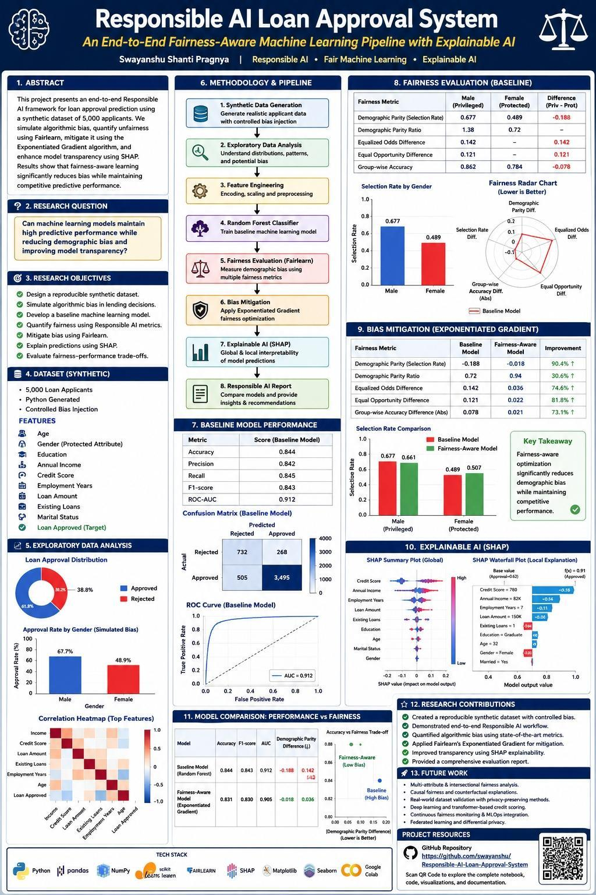

# Responsible AI Loan Approval System: An End-to-End Fairness-Aware Machine Learning Pipeline

## Overview

This research project presents an end-to-end **Responsible AI** pipeline for loan approval prediction, demonstrating how fairness, transparency, and explainability can be integrated into the machine learning lifecycle. Rather than relying on publicly available datasets, a synthetic dataset containing 5,000 loan applicants was generated to simulate realistic financial and demographic characteristics while enabling controlled experimentation with algorithmic bias.

## Research Objectives

The primary objectives of this project are to:

* Design a reproducible synthetic dataset for loan approval prediction.
* Simulate real-world algorithmic bias against a protected demographic group.
* Train and evaluate a baseline machine learning model.
* Quantify fairness using established Responsible AI metrics.
* Mitigate bias using fairness-aware machine learning techniques.
* Improve model transparency through Explainable AI (XAI).
* Compare predictive performance before and after fairness mitigation.

## Methodology

The synthetic dataset includes features such as age, gender, education, employment experience, annual income, credit score, loan amount, existing loans, and marital status. To emulate historical bias often observed in financial decision-making systems, the loan approval probability for one protected group was intentionally reduced during data generation.

A baseline **Random Forest** classifier was trained and evaluated using standard machine learning metrics, including Accuracy, Precision, Recall, F1-score, ROC-AUC, Confusion Matrix, and Feature Importance. The project then assessed algorithmic fairness using **Fairlearn**, measuring Demographic Parity Difference, Demographic Parity Ratio, Equalized Odds Difference, Selection Rate, and Group-wise Accuracy.

To reduce unfair outcomes, the **Exponentiated Gradient** fairness mitigation algorithm was applied, enabling a comparison between predictive performance and fairness-aware optimization.

## Explainable AI

Model interpretability was enhanced using **SHAP (SHapley Additive Explanations)** to provide both global and local explanations of model predictions. SHAP visualizations were used to identify influential features and verify that model decisions aligned with meaningful financial attributes.

## Results

The project demonstrates that fairness-aware optimization can significantly reduce demographic bias while maintaining competitive predictive performance. A Responsible AI dashboard and comparative evaluation report summarize model accuracy, fairness metrics, explainability results, and the trade-offs between predictive performance and fairness.

## Technologies

* Python
* Google Colab
* Pandas
* NumPy
* Scikit-learn
* Fairlearn
* SHAP
* Matplotlib
* Seaborn

## Repository Structure

```text
├── data/
│   └── Synthetic Dataset Generation
├── notebooks/
│   ├── Part 1 – Synthetic Data & EDA
│   ├── Part 2 – Baseline Machine Learning Model
│   ├── Part 3 – Responsible AI & Fairness Mitigation
│   └── Part 4 – Explainable AI & Final Report
├── reports/
│   └── Responsible AI Evaluation Report
├── images/
│   └── Visualizations and SHAP Outputs
└── README.md
```

## Research Contributions

* Developed a fully reproducible Responsible AI workflow using synthetic data.
* Demonstrated algorithmic bias detection and quantitative fairness evaluation.
* Applied fairness-aware machine learning using Fairlearn's Exponentiated Gradient algorithm.
* Integrated Explainable AI using SHAP for transparent model interpretation.
* Produced a comprehensive Responsible AI evaluation framework suitable for educational, research, and portfolio applications.

## Future Work
## Future Work

Although this project demonstrates a complete Responsible AI pipeline, several areas can be extended for future research and real-world deployment.

* Multi-Attribute Fairness Analysis: Extend fairness evaluation beyond a single protected attribute by analyzing intersectional groups such as combinations of gender, age, education, and socioeconomic factors.

* Real-World Dataset Validation: Evaluate the framework using real-world financial datasets while applying appropriate privacy-preserving techniques and ethical data governance practices.

* Advanced Fairness Techniques: Compare multiple bias mitigation approaches, including pre-processing methods, in-processing optimization algorithms, and post-processing threshold adjustments.

* Causal Fairness Analysis: Incorporate causal machine learning techniques to better understand the underlying causes of bias and distinguish between correlation and causation in decision-making systems.

* Model Benchmarking: Compare multiple machine learning and deep learning architectures, including Gradient Boosting, Neural Networks, and Large Language Model-based approaches, while evaluating fairness-performance trade-offs.

* Continuous Fairness Monitoring: Develop a production-ready monitoring framework to track model drift, fairness degradation, and changes in data distribution after deployment.

* Privacy-Preserving AI: Explore techniques such as federated learning and differential privacy to enable secure AI development while protecting sensitive financial information.

* Interactive Responsible AI Dashboard: Build an interactive dashboard for stakeholders to monitor model predictions, fairness metrics, feature importance, and explainability results in real time.

These extensions would help transform this research prototype into a scalable, transparent, and trustworthy AI decision-support system suitable for real-world applications in financial services and other high-impact domains.

